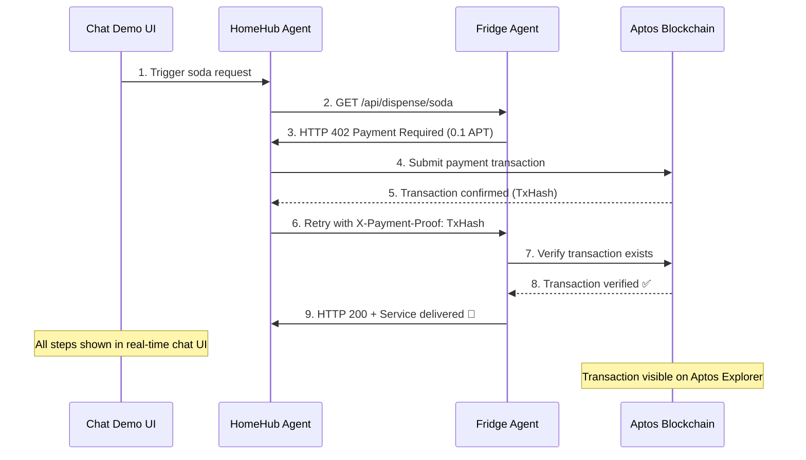
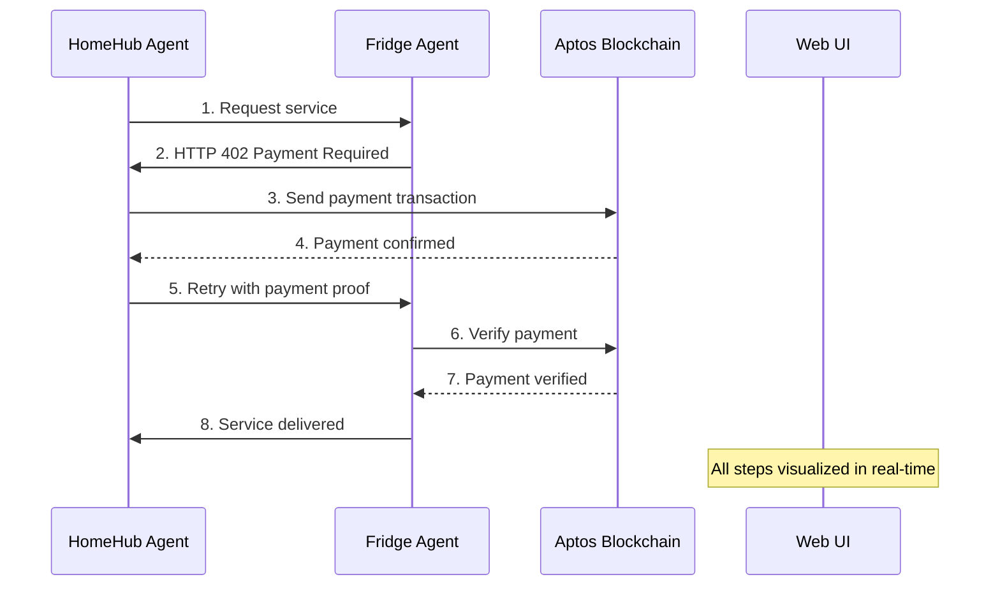

# 🤖 AI Agent Commerce Demo on Aptos

A comprehensive demonstration of autonomous AI agents conducting real blockchain commerce using the Aptos network, with real-time visualization of agent-to-agent communication.

## 🌟 What This Demonstrates

This project showcases a future where AI agents can:

- 🔄 **Autonomous Commerce**: AI agents buy/sell services independently
- 💰 **Real Blockchain Payments**: Live Aptos blockchain transactions (viewable on explorer)
- 🤖 **AI Decision Making**: Make financial decisions using Google Gemini AI
- 📡 **HTTP 402 Protocol**: Payment-required API gateway with blockchain verification
- 💬 **Real-time Chat UI**: Watch agent interactions live with beautiful visualization
- 🎭 **Demo-Ready Interface**: Perfect for presentations and live demonstrations

## 🏗️ System Architecture

```
┌─────────────────┐    ┌─────────────────┐    ┌─────────────────┐
│   HomeHub Agent │────│   Fridge Agent  │    │   Chat Demo UI  │
│  (AI Buyer)     │    │  (AI Seller)    │    │  (Visualization)│
│                 │    │                 │    │                 │
│ • AI Decision   │    │ • Payment Gate  │    │ • Real-time     │
│ • Real Aptos TX │    │ • AI Responses  │    │ • Socket.IO     │
│ • Auto-retry    │    │ • TX Verify     │    │ • Agent Monitor │
└─────────────────┘    └─────────────────┘    └─────────────────┘
         │                       │                       │
         └───────────────────────┼───────────────────────┘
                                 │
                    ┌─────────────────┐
                    │  Aptos Devnet   │
                    │   (Live TX)     │
                    └─────────────────┘
```

## 🚀 Quick Start Guide

### 1. Clone & Setup

```bash
git clone <your-repo>
cd aptos-x402

# Install dependencies for all components
cd fridge-agent && npm install && cd ..
cd homehub-agent && npm install && cd ..
cd chat-demo && npm install && cd ..
```

### 2. Configure Wallet Keys

Create `.env` files with your Aptos devnet private keys:

**fridge-agent/.env**:

```env
APTOS_PRIVATE_KEY=0x1234...  # Your Aptos devnet private key
GOOGLE_API_KEY=AIzaSy...     # Your Google AI API key
```

**homehub-agent/.env**:

```env
APTOS_PRIVATE_KEY=0x5678...  # Different Aptos devnet private key
GOOGLE_API_KEY=AIzaSy...     # Your Google AI API key
```

### 3. Launch the Demo System

```bash
# Terminal 1: Start Fridge Agent (Seller)
cd fridge-agent && npm start

# Terminal 2: Start HomeHub Agent (Buyer)
cd homehub-agent && npm start

# Terminal 3: Start Chat Demo UI
cd chat-demo && npm start
```

### 4. Experience the Demo

1. **Open**: http://localhost:4001
2. **Click**: "Start Soda Request"
3. **Watch**: Real AI agents negotiate and transact on live blockchain!
4. **Verify**: Check transactions on [Aptos Explorer](https://explorer.aptoslabs.com/?network=devnet)

## 📋 Component Details

### 🤖 HomeHub Agent (`homehub-agent/`)

**The Autonomous Buyer** - Intelligent purchasing agent that:

- 🧠 Makes contextual decisions using Google Gemini AI
- 💳 Handles payment requests automatically
- 🔗 Executes real Aptos blockchain transactions
- 🔄 Retries with payment proofs when required
- 📱 Works autonomously without human intervention

### ❄️ Fridge Agent (`fridge-agent/`)

**The Payment-Gated Service** - Smart vending API that:

- 🚪 Guards services behind HTTP 402 Payment Required
- ✅ Verifies blockchain transactions automatically
- 🤖 Generates AI-powered conversational responses
- 💰 Accepts APT cryptocurrency payments
- 🛡️ Implements secure payment verification

### 🎭 Chat Demo (`chat-demo/`)

**Live Interaction Visualizer** - Real-time demo interface featuring:

- 💬 **Agent-to-Agent Chat**: Watch conversations unfold live
- 📊 **Transaction Tracking**: See blockchain payments in real-time
- 🎬 **Demo Controls**: One-click interaction triggering
- 📱 **Responsive Design**: Works on all devices
- ⚡ **Socket.IO Integration**: Instant message updates
- 🎨 **Beautiful UI**: Professional presentation-ready interface

## 🔄 Transaction Flow



## 🛠️ Technology Stack

- **🔗 Blockchain**: Aptos SDK v5.1.0 (Devnet with real transactions)
- **🤖 AI**: Google Generative AI (Gemini Pro)
- **⚙️ Backend**: Node.js, Express.js
- **🎨 Frontend**: HTML5, CSS3, JavaScript
- **📡 Real-time**: Socket.IO WebSockets
- **💰 Payment**: HTTP 402 Payment Required protocol
- **🎭 Demo**: Live chat interface with agent monitoring

## 💡 Real-World Applications

This demo architecture enables:

1. **🏠 IoT Micropayments**: Smart devices paying for cloud services
2. **📡 API Monetization**: Per-request API billing with instant settlement
3. **🎯 Content Gates**: AI-generated content behind micropayments
4. **🔧 Service Mesh Billing**: Microservices charging each other automatically
5. **🤖 AI-to-AI Commerce**: Fully autonomous digital economies
6. **⚡ Instant Settlement**: No waiting for traditional payment processing

## 🎬 Demo Features

### For Live Presentations:

- ✅ **One-Click Demo**: Single button starts entire interaction
- ✅ **Real Blockchain**: Actual transactions on Aptos devnet
- ✅ **Visual Feedback**: Chat bubbles show agent thinking process
- ✅ **Transaction Links**: Direct links to blockchain explorer
- ✅ **Professional UI**: Clean, modern interface for demos
- ✅ **Error Handling**: Graceful handling of network issues
- ✅ **Status Monitoring**: Live agent health indicators

### Technical Highlights:

- 🔧 **Hardcoded Success Mode**: Demo-optimized payment verification
- ⚡ **Real-time Updates**: Instant UI updates via WebSockets
- 🎯 **Agent Orchestration**: Automated multi-agent workflows
- 🛡️ **Error Recovery**: Robust retry and fallback mechanisms

## 🔧 Development & Testing

### Manual Testing:

```bash
# Test Fridge Agent directly
curl http://localhost:3000/api/dispense/soda
# Returns: HTTP 402 Payment Required

# Test with payment proof
curl -H "X-Payment-Proof: 0xTX_HASH" http://localhost:3000/api/dispense/soda
# Returns: HTTP 200 with soda dispensed
```

### Individual Component Testing:

```bash
# Test components separately
cd fridge-agent && npm test
cd homehub-agent && npm test
cd chat-demo && npm test
```

## 🌐 Network Configuration

**Current Setup**: Aptos Devnet

- **Fullnode**: https://fullnode.devnet.aptoslabs.com/v1
- **Faucet**: https://faucet.devnet.aptoslabs.com
- **Explorer**: https://explorer.aptoslabs.com/?network=devnet
- **Currency**: APT (Aptos Coins)

**Production Ready**: Easily switch to Mainnet by updating endpoints

## 🎯 Perfect Demo Script

1. **🎬 Introduction**: "Watch two AI agents conduct real blockchain commerce"
2. **🚀 Launch**: Open http://localhost:4001 and click "Start Soda Request"
3. **👀 Observe**: Point out real-time chat, payment request, blockchain transaction
4. **🔗 Verify**: Show transaction on Aptos Explorer
5. **🎉 Conclusion**: "Fully autonomous, real blockchain, AI-to-AI commerce!"

## 📈 What's Next

Future enhancements:

- 🌍 **Multi-chain Support**: Ethereum, Solana integration
- 🏪 **Agent Marketplace**: Discover and connect to agent services
- 📊 **Analytics Dashboard**: Payment volume, success rates, performance metrics
- 🔒 **Enhanced Security**: Multi-signature, fraud detection
- 🎮 **Gamification**: Agent reputation, rewards, achievement systems

## 🤝 Contributing

1. Fork the repository
2. Create feature branches (`feature/your-feature`)
3. Test with the full demo system
4. Submit pull requests with demo screenshots

## 📜 License

MIT License - Build the future of autonomous AI commerce!

---

## 🎪 Demo Highlights

**🎯 Perfect for showing:**

- ✨ **AI Autonomy**: Agents make independent financial decisions
- ⚡ **Real Blockchain**: Live transactions on Aptos network
- 💬 **Agent Communication**: Natural language AI interaction
- 🎨 **Professional UI**: Presentation-ready interface
- 🔄 **End-to-End Flow**: Complete commerce cycle in under 30 seconds

**🚀 Ready to demonstrate the future of AI commerce?**  
**Start the system and click "Start Soda Request"!** 🥤

## 📋 Components

### 🤖 HomeHub Agent (`homehub-agent/`)

**The AI Buyer** - An autonomous client that:

- Makes intelligent requests for services
- Handles HTTP 402 payment challenges automatically
- Uses blockchain to send micropayments
- Leverages AI to make purchasing decisions
- Retries requests with payment proofs

### ❄️ Fridge Agent (`fridge-agent/`)

**The AI Seller** - A smart API service that:

- Requires payment before delivering services
- Verifies blockchain transactions automatically
- Generates AI-powered responses
- Implements proper x402 protocol flow
- Guards premium content behind payments

### 🖥️ Web UI (`web-ui/`)

**Real-time Visualization** - Modern interface featuring:

- Live chat between agents
- Payment flow visualization
- Transaction tracking
- Manual testing controls
- Beautiful, responsive design

## 🔄 x402 Protocol Flow



## 🛠️ Technology Stack

- **Blockchain**: Aptos SDK v5.1.0 (Devnet)
- **AI**: Google Generative AI (Gemini)
- **Backend**: Node.js, Express.js
- **Frontend**: React 19, Vite 7
- **Real-time**: Socket.IO
- **Styling**: Modern CSS with gradients
- **Icons**: Lucide React

## 💡 Use Cases

This demo showcases potential applications:

1. **IoT Device Payments**: Smart home devices paying for cloud services
2. **API Micropayments**: Per-request API billing with instant settlement
3. **Content Monetization**: AI-generated content behind micropayments
4. **Service Meshes**: Microservices charging each other automatically
5. **AI-to-AI Commerce**: Autonomous agents conducting business

## 🔧 Development & Testing

### Running Individual Components:

```bash
# Fridge Agent (Seller Service)
cd fridge-agent && npm start

# HomeHub Agent (Buyer Client)
cd homehub-agent && node index.js

# Chat Demo UI (Visualization)
cd chat-demo && npm start
```

### Direct API Testing:

```bash
# Test Fridge Agent without payment (expects 402)
curl http://localhost:3000/api/dispense/soda

# Test Fridge Agent with payment proof (expects 200)
curl -H "X-Payment-Proof: 0xTX_HASH..." http://localhost:3000/api/dispense/soda
```

### Integration Testing:

1. **Automated Flow**: Use Chat Demo UI's "Start Soda Request" button
2. **Manual Trigger**: Run HomeHub Agent directly to see terminal output
3. **API Monitoring**: Watch Chat Demo for real-time agent communication
4. **Blockchain Verification**: Check transactions on Aptos Explorer

### Development Mode:

```bash
# Auto-restart on file changes
cd chat-demo && npm run dev
```

## 🌐 Network Configuration

Currently configured for Aptos **Devnet**:

- Network: https://fullnode.devnet.aptoslabs.com/v1
- Faucet: https://faucet.devnet.aptoslabs.com
- Explorer: https://explorer.aptoslabs.com/?network=devnet

## 🤝 Contributing

1. Fork the repository
2. Create feature branches
3. Test with the UI system
4. Submit pull requests

## 📜 License

MIT License - Build the future of AI commerce!

---

**🎯 Perfect for demonstrating:**

- Autonomous AI decision-making
- Blockchain micropayments
- Real-time agent communication
- Modern web interfaces
- x402 protocol implementation

_Ready to watch AI agents trade with each other? Start the system and click "Start x402 Flow"!_ 🚀
