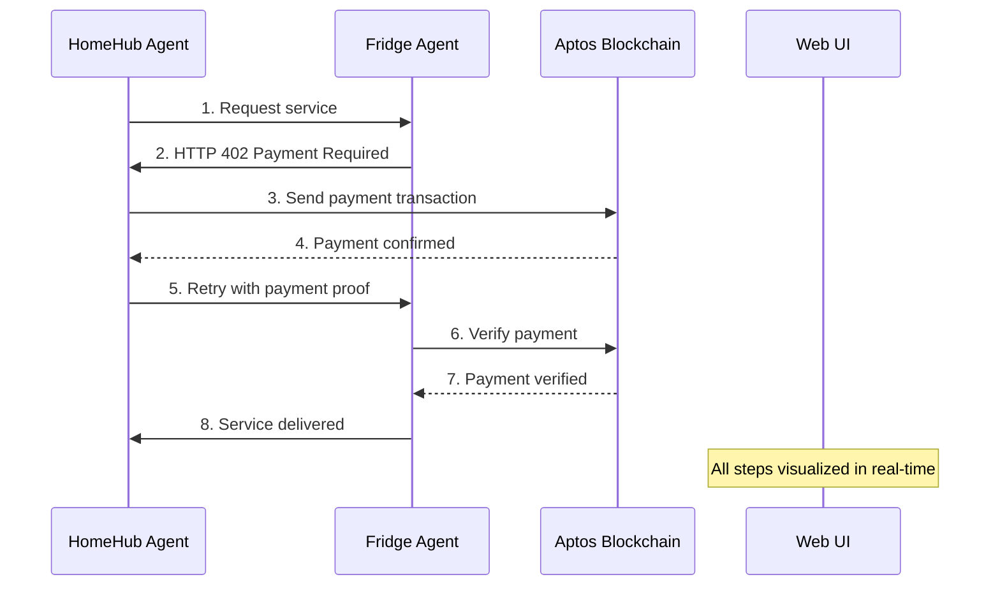

# 🤖 x402 Protocol Demo: AI-to-AI Commerce

A demonstration of autonomous AI agents conducting commerce using the x402 protocol (HTTP 402 Payment Required + Blockchain verification) on the Aptos network.

## 🌟 What This Demonstrates

This project showcases a future where AI agents can:

- 🔄 **Autonomous Commerce**: AI agents buy/sell services independently
- 💰 **Blockchain Payments**: Use Aptos blockchain for instant micropayments
- 🤖 **AI Decision Making**: Make financial decisions using Google Gemini AI
- 📡 **x402 Protocol**: Implement HTTP 402 with blockchain payment verification
- 💬 **Real-time Visualization**: Watch agent interactions live in a modern UI

## 🏗️ Architecture

```
┌─────────────────┐    ┌─────────────────┐    ┌─────────────────┐
│   HomeHub Agent │    │   Fridge Agent  │    │    Web UI       │
│  (Buyer/Client) │────│  (Seller/API)   │────│  (Visualization)│
│                 │    │                 │    │                 │
│ • AI Decision   │    │ • Payment Check │    │ • Real-time     │
│ • Blockchain    │    │ • AI Responses  │    │ • Socket.IO     │
│ • Auto-pay      │    │ • Service Gate  │    │ • React + Vite  │
└─────────────────┘    └─────────────────┘    └─────────────────┘
         │                       │                       │
         └───────────────────────┼───────────────────────┘
                                 │
                    ┌─────────────────┐
                    │  Aptos Devnet   │
                    │   Blockchain    │
                    └─────────────────┘
```

## 🚀 Quick Start

### 1. Setup Environment

```bash
# Clone and navigate
git clone <your-repo>
cd aptos-x402

# Install dependencies for all agents
cd fridge-agent && npm install && cd ..
cd homehub-agent && npm install && cd ..
cd web-ui && npm install && cd ..
```

### 2. Configure API Keys

Create `.env` files in each agent directory:

**fridge-agent/.env**:

```env
APTOS_PRIVATE_KEY=0x1234...  # Your Aptos devnet private key
GOOGLE_API_KEY=AIzaSy...     # Your Google AI API key
```

**homehub-agent/.env**:

```env
APTOS_PRIVATE_KEY=0x5678...  # Different Aptos devnet private key
GOOGLE_API_KEY=AIzaSy...     # Your Google AI API key
```

### 3. Start the System

```bash
# Terminal 1: Start Fridge Agent (Seller)
cd fridge-agent && npm start

# Terminal 2: Start Web UI (includes backend)
cd web-ui && npm run start:all

# Terminal 3 (Optional): Start HomeHub Agent manually
cd homehub-agent && node index.js
```

### 4. Watch the Magic

1. Open http://localhost:5173 in your browser
2. Click "Start x402 Flow" to trigger autonomous agent communication
3. Watch AI agents negotiate, pay, and deliver services in real-time!

## 📋 Components

### 🤖 HomeHub Agent (`homehub-agent/`)

**The AI Buyer** - An autonomous client that:

- Makes intelligent requests for services
- Handles HTTP 402 payment challenges automatically
- Uses blockchain to send micropayments
- Leverages AI to make purchasing decisions
- Retries requests with payment proofs

### ❄️ Fridge Agent (`fridge-agent/`)

**The AI Seller** - A smart API service that:

- Requires payment before delivering services
- Verifies blockchain transactions automatically
- Generates AI-powered responses
- Implements proper x402 protocol flow
- Guards premium content behind payments

### 🖥️ Web UI (`web-ui/`)

**Real-time Visualization** - Modern interface featuring:

- Live chat between agents
- Payment flow visualization
- Transaction tracking
- Manual testing controls
- Beautiful, responsive design

## 🔄 x402 Protocol Flow



## 🛠️ Technology Stack

- **Blockchain**: Aptos SDK v5.1.0 (Devnet)
- **AI**: Google Generative AI (Gemini)
- **Backend**: Node.js, Express.js
- **Frontend**: React 19, Vite 7
- **Real-time**: Socket.IO
- **Styling**: Modern CSS with gradients
- **Icons**: Lucide React

## 💡 Use Cases

This demo showcases potential applications:

1. **IoT Device Payments**: Smart home devices paying for cloud services
2. **API Micropayments**: Per-request API billing with instant settlement
3. **Content Monetization**: AI-generated content behind micropayments
4. **Service Meshes**: Microservices charging each other automatically
5. **AI-to-AI Commerce**: Autonomous agents conducting business

## 🔧 Development

### Running Individual Components

```bash
# Fridge Agent only
cd fridge-agent && npm start

# HomeHub Agent only
cd homehub-agent && node index.js

# Web UI Frontend only
cd web-ui && npm run dev

# Web UI Backend only
cd web-ui && npm run backend
```

### Testing the Protocol

1. **Manual API Testing**:

```bash
# Test without payment (should get 402)
curl http://localhost:3000/fridge/status

# Test with mock payment proof
curl -H "X-Payment-Proof: 0x..." http://localhost:3000/fridge/status
```

2. **AI Agent Testing**: Watch the UI for autonomous interactions

3. **Integration Testing**: Use the web UI's manual controls

## 🌐 Network Configuration

Currently configured for Aptos **Devnet**:

- Network: https://fullnode.devnet.aptoslabs.com/v1
- Faucet: https://faucet.devnet.aptoslabs.com
- Explorer: https://explorer.aptoslabs.com/?network=devnet

## 🤝 Contributing

1. Fork the repository
2. Create feature branches
3. Test with the UI system
4. Submit pull requests

## 📜 License

MIT License - Build the future of AI commerce!

---

**🎯 Perfect for demonstrating:**

- Autonomous AI decision-making
- Blockchain micropayments
- Real-time agent communication
- Modern web interfaces
- x402 protocol implementation

_Ready to watch AI agents trade with each other? Start the system and click "Start x402 Flow"!_ 🚀
